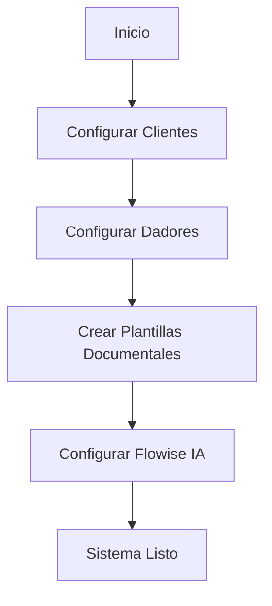
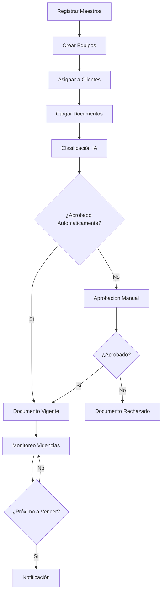
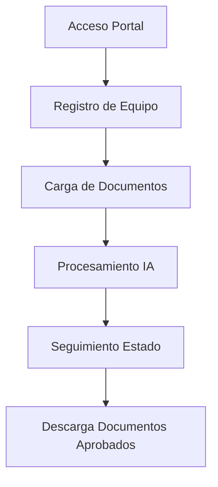
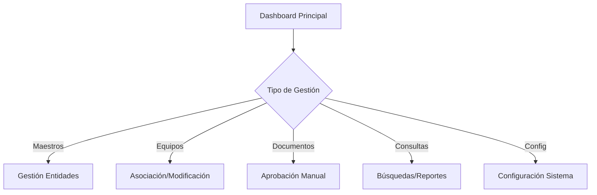

# Manual de Usuario - Microservicio de Documentos

## 📋 Índice

1. [Introducción](#introducción)
2. [Acceso al Sistema](#acceso-al-sistema)
3. [Navegación Principal](#navegación-principal)
4. [Pestañas/Módulos del Sistema](#pestañasmódulos-del-sistema)
5. [Workflow Lógico de Uso](#workflow-lógico-de-uso)
6. [Portal de Transportistas](#portal-de-transportistas)
7. [Configuración del Sistema](#configuración-del-sistema)
8. [Casos de Uso Comunes](#casos-de-uso-comunes)
9. [Troubleshooting](#troubleshooting)

---

## 🎯 Introducción

El **Microservicio de Documentos** es una plataforma integral diseñada para gestionar la documentación de transportistas de manera automatizada e inteligente. Utiliza inteligencia artificial para clasificar documentos, validar información y mantener el control de vigencias de manera profesional y eficiente.

### Características Principales
- ✅ **Gestión completa de documentos** por entidad (choferes, camiones, acoplados, empresas)
- 🤖 **Clasificación automática con IA** mediante integración con Flowise
- 📊 **Sistema de semáforos** para control de vigencias (verde/amarillo/rojo)
- 🔍 **Búsqueda avanzada** por múltiples criterios
- 📋 **Aprobación manual** con preview de documentos
- 📈 **Dashboard con métricas** en tiempo real

---

## 🔐 Acceso al Sistema

### Roles de Usuario
- **SUPERADMIN**: Acceso completo a todas las funcionalidades

### URL de Acceso
El sistema se encuentra disponible en https://bca.microsyst.com.ar

---

## 🧭 Navegación Principal

### Página Principal
La pantalla principal (`/documentos`) presenta:

1. **Header con Navegación por Pestañas**
   - Botones para acceder a cada módulo
   - Información de estado del sistema

2. **Indicadores de Gestión**
   - Pendientes de aprobación
   - Estadísticas generales (vencidos/por vencer/vigentes)
   - Estado de procesamiento por lotes

3. **Lista de Dadores de Carga**
   - Tarjetas con información resumida
   - Indicadores de semáforo por dador
   - Acceso directo a documentos por dador

---

## 📁 Pestañas/Módulos del Sistema

### 1. **Clientes** (`/documentos/clientes`)

**Propósito**: Gestión de empresas clientes que requieren documentación de transportistas.

**Funcionalidades**:
- ➕ **Crear clientes**: Registro con razón social y CUIT
- ⚙️ **Configuración por defecto**: Selección de cliente principal
- 🔧 **Configuración de sistema**: 
  - Delay de verificación de faltantes (minutos)
  - Horizonte sin vencimiento (años)
- 📋 **Gestión de requisitos**: Definir documentos requeridos por cliente
- ✏️ **Edición**: Activar/desactivar clientes existentes

**Casos de Uso**:
- Registrar nuevos clientes que requieren documentación específica
- Configurar requisitos documentales personalizados
- Establecer cliente por defecto para asignaciones automáticas

### 2. **Empresas Transportistas** (`/documentos/empresas-transportistas`)

**Propósito**: Administración de empresas de transporte que operan con los equipos.

**Funcionalidades**:
- 📝 **Registro de empresas**: Con datos completos y contacto
- 📞 **Gestión de contacto**: Múltiples números de WhatsApp
- 🔗 **Asociación con equipos**: Vinculación empresa-vehículo
- 📊 **Control de documentación**: Seguimiento por empresa

### 3. **Choferes** (`/documentos/choferes`)

**Propósito**: Gestión de conductores y su documentación personal.

**Funcionalidades**:
- 👤 **Registro por DNI**: Datos personales completos
- 📱 **Múltiples teléfonos**: Hasta 3 números WhatsApp por chofer
- 🔍 **Búsqueda avanzada**: Por DNI, nombre o apellido
- 📊 **Paginación**: Manejo eficiente de grandes volúmenes
- ⚡ **Gestión rápida**: Activar/desactivar/eliminar

**Casos de Uso**:
- Registrar nuevos conductores al sistema
- Actualizar datos de contacto para notificaciones
- Buscar choferes específicos para asignación de equipos

### 4. **Camiones** (`/documentos/camiones`)

**Propósito**: Administración de vehículos tractores.

**Funcionalidades**:
- 🚛 **Registro por patente**: Normalización automática de formato
- 🔗 **Asociación con dadores**: Vinculación empresa-vehículo
- 📋 **Control documental**: VTV, seguros, habilitaciones
- 🔍 **Búsqueda por patente**: Localización rápida

### 5. **Acoplados** (`/documentos/acoplados`)

**Propósito**: Gestión de semirremolques y acoplados.

**Funcionalidades**:
- 🚚 **Registro opcional**: No todos los equipos requieren acoplado
- 🔄 **Intercambio flexible**: Cambio de acoplados en equipos
- 📊 **Documentación específica**: VTV, seguros, habilitaciones

### 6. **Equipos** (`/documentos/equipos`)

**Propósito**: **Módulo central** para asociación y gestión integral de equipos (chofer + camión + acoplado opcional).

**Funcionalidades**:
- 🔧 **Creación de equipos**:
  - Por selección de dropdowns (elementos existentes)
  - Por alta mínima (DNI + patentes, creación automática si no existen)
  - Importación masiva por CSV

- 📊 **Semáforo de compliance**:
  - 🔴 Faltantes y vencidos
  - 🟡 Por vencer próximamente  
  - 🟢 Vigentes y aprobados

- 🔍 **Búsqueda potente**:
  - Por DNI del chofer
  - Por patente de camión
  - Por patente de acoplado
  - Combinación de criterios

- ⚙️ **Gestión de componentes**:
  - Attach/Swap de chofer, camión, acoplado
  - Detach de semirremolque
  - Cambio de empresa transportista

- 📥 **Descarga de documentación**:
  - ZIP automático con documentos vigentes
  - Conserva nombres originales de archivos
  - Solo incluye documentos aprobados

- 📊 **KPIs y métricas**:
  - Equipos creados (últimos 7 días)
  - Swaps/movimientos realizados
  - Equipos eliminados

- 📋 **Historial completo**:
  - Registro de todas las operaciones
  - Filtros por tipo de acción
  - Trazabilidad completa

**Casos de Uso Principales**:
- Formar equipos nuevos para operaciones
- Realizar intercambios de vehículos (swaps)
- Monitorear estado documental por equipo
- Descargar documentación para controles

### 7. **Dadores** (`/documentos/dadores`)

**Propósito**: Administración de empresas dadores de carga.

**Funcionalidades**:
- 🏢 **Registro de dadores**: Empresas que generan cargas
- 📞 **Configuración de notificaciones**:
  - Envío a chofer (WhatsApp)
  - Envío a dador (email/WhatsApp)
- ⚙️ **Configuraciones globales**: Parámetros del sistema
- 🔧 **Dador por defecto**: Selección para nuevos registros

### 8. **Consulta** (`/documentos/consulta`)

**Propósito**: Búsqueda transversal y consultas especializadas.

**Funcionalidades**:
- 🔍 **Búsqueda múltiple**: DNI, patente camión, patente acoplado
- 📁 **Importación CSV**: Búsqueda masiva por lista de DNIs
- 📥 **Descarga masiva**: ZIP con documentación de múltiples equipos
- 💾 **Persistencia**: Guarda último criterio de búsqueda
- 🔄 **Resultados en tiempo real**: Actualización automática

**Casos de Uso**:
- Auditorías por listas de DNIs
- Consultas específicas de clientes
- Descargas masivas para controles externos

### 9. **Plantillas** (`/plantillas`)

**Propósito**: Configuración de tipos de documentos del sistema.

**Funcionalidades**:
- 📋 **Gestión de tipos**: Crear/editar/eliminar plantillas
- 🏷️ **Clasificación por entidad**: CHOFER, CAMION, ACOPLADO, EMPRESA_TRANSPORTISTA
- ⚡ **Activación/desactivación**: Control de plantillas activas
- 📊 **Estadísticas**: Resumen de plantillas por tipo y estado

### 10. **Dashboard** (`/documentos/dashboard`)

**Propósito**: Métricas y visualización ejecutiva.

**Funcionalidades**:
- 📈 **Indicadores clave**: Documentos por estado
- 🎯 **Métricas por dador**: Análisis detallado
- 📊 **Tendencias temporales**: Evolución de compliance
- 🚨 **Alertas**: Vencimientos próximos

### 11. **Aprobación Manual** (`/documentos/aprobacion`)

**Propósito**: Revisión y validación de documentos pendientes.

**Funcionalidades**:
- 👁️ **Preview de documentos**: Visualización completa
- 🤖 **Datos detectados por IA**:
  - Tipo de entidad (chofer/camión/etc.)
  - Identidad detectada (DNI/patente)
  - Tipo de documento
  - Fecha de vencimiento
- ✅ **Aprobación asistida**:
  - Corrección de datos si es necesario
  - Asignación de plantilla correcta
  - Confirmación de vencimientos
- ❌ **Rechazo con motivo**: Justificación del rechazo
- 📝 **Notas de revisión**: Comentarios del aprobador

**Workflow de Aprobación**:
1. **Lista de pendientes**: Vista de documentos esperando revisión
2. **Selección**: Click en documento para revisar
3. **Verificación**: Contraste entre datos detectados y reales
4. **Corrección**: Ajuste de campos si es necesario
5. **Decisión**: Aprobar o rechazar con motivo
6. **Registro**: Almacenamiento de decisión y trazabilidad

---

## 🔄 Workflow Lógico de Uso

### **Flujo Inicial - Configuración del Sistema**

1. **Configurar Clientes**: Registrar empresas que requieren documentación
2. **Configurar Dadores**: Establecer empresas generadoras de carga
3. **Crear Plantillas**: Definir tipos de documentos por entidad
4. **Configurar IA**: Conectar Flowise para clasificación automática
5. **Sistema Operativo**: Listo para registro de equipos

### **Flujo Operativo - Gestión de Equipos**

### **Flujo de Transportista**

### **Flujo de Administrador**

---

## 📱 Portal de Transportistas

### **Acceso**: `/portal/transportistas`

El portal está optimizado para dispositivos móviles y ofrece una experiencia simplificada para transportistas.

### **Pestañas del Portal**:

#### 📊 **Dashboard/Panel**
- **Cumplimiento documentario**: Semáforo visual del estado
- **Próximos vencimientos**: Alertas tempranas
- **Estadísticas personales**: Métricas del transportista

#### ➕ **Registro**
- **Creación de equipos**: Formulario simplificado
  - DNI del chofer
  - Patente del tractor
  - Patente del acoplado (opcional)
  - Teléfonos WhatsApp (hasta 3)
  - Selección de dador de carga
- **Validación automática**: Control de formato en tiempo real

#### 📄 **Documentos**
- **Carga masiva inteligente**: 
  - Selección múltiple de archivos
  - Procesamiento con IA automática
  - Barra de progreso en tiempo real
  - Notificaciones de estado por documento
- **Reintentos automáticos**: Para documentos rechazados

#### 🚛 **Mis Equipos**
- **Lista personal**: Equipos registrados por el transportista
- **Estado por equipo**: Semáforo de documentación
- **Descarga rápida**: ZIP con documentos vigentes por equipo

#### 📅 **Calendario**
- **Vencimientos próximos**: Vista calendario inteligente
- **Recordatorios**: Notificaciones personalizadas

#### 👤 **Perfil**
- **Datos personales**: Información del transportista
- **Configuración**: Preferencias de notificaciones

---

## ⚙️ Configuración del Sistema

### **Flowise (IA)** - `/configuracion/flowise`

**Propósito**: Configuración de la inteligencia artificial para clasificación automática.

**Parámetros**:
- 🔗 **URL Base**: Dirección del servidor Flowise
- 🔑 **API Key**: Clave de autenticación (opcional)
- 🆔 **Flow ID**: Identificador del flujo de validación
- ⏱️ **Timeout**: Tiempo máximo de espera (segundos)
- ✅ **Habilitación**: Activar/desactivar procesamiento IA

**Funcionalidades**:
- 🧪 **Test de conexión**: Verificación en tiempo real
- 📊 **Métricas de respuesta**: Tiempo de procesamiento
- 🔄 **Reintentos automáticos**: Manejo de errores de conexión

### **Evolution API** - `/configuracion/evolution`

**Propósito**: Configuración de notificaciones por WhatsApp.

### **Notificaciones** - `/configuracion/notificaciones`

**Propósito**: Gestión de alertas y comunicaciones automáticas.

---

## 💼 Casos de Uso Comunes

### **Caso 1: Nuevo Transportista**
1. **Registrar chofer** en módulo Choferes
2. **Registrar vehículos** en módulos Camiones/Acoplados
3. **Crear equipo** en módulo Equipos
4. **Asignar cliente** según requisitos
5. **Cargar documentos** vía portal o carga masiva
6. **Aprobar documentos** pendientes si es necesario

### **Caso 2: Intercambio de Vehículos (Swap)**
1. **Acceder a Equipos**
2. **Seleccionar equipo origen**
3. **Gestionar componentes** → Cambiar camión/acoplado
4. **Confirmar operación** con auto-cierre del equipo anterior

### **Caso 3: Auditoría por Cliente**
1. **Ir a Consulta**
2. **Cargar CSV** con DNIs a verificar
3. **Revisar resultados** con semáforos por equipo
4. **Descargar ZIP** masivo con documentación vigente
5. **Generar reporte** de cumplimiento

### **Caso 4: Control de Vencimientos**
1. **Dashboard principal** → Ver alertas de vencimientos
2. **Notificaciones automáticas** a transportistas
3. **Seguimiento en Equipos** por estado de semáforo
4. **Gestión proactiva** de renovaciones

---

## 🔧 Troubleshooting

### **Problemas Comunes**

#### **Documentos no se clasifican automáticamente**
- ✅ Verificar conexión Flowise en `/configuracion/flowise`
- ✅ Confirmar que el Flow ID es correcto
- ✅ Revisar logs de procesamiento en Dashboard

#### **Búsquedas sin resultados**
- ✅ Verificar formatos de DNI (solo números)
- ✅ Confirmar normalización de patentes (mayúsculas, sin espacios)
- ✅ Revisar filtros por dador de carga

#### **Problemas de performance**
- ✅ Usar paginación en listas grandes
- ✅ Aplicar filtros específicos en búsquedas
- ✅ Revisar estado de jobs de procesamiento

#### **Notificaciones no llegan**
- ✅ Verificar configuración de Evolution API
- ✅ Confirmar números de WhatsApp válidos
- ✅ Revisar configuración por dador (envío habilitado)

### **Contacto y Soporte**

Para problemas técnicos o consultas sobre funcionalidades específicas, consultar con el equipo de desarrollo o revisar los logs del sistema en el módulo de health check disponible en `/health/detailed`.

---

## 📚 Conclusión

El Microservicio de Documentos ofrece una solución integral para la gestión documental de transportistas, combinando automatización inteligente con controles manuales precisos. Su diseño modular permite adaptarse a diferentes flujos de trabajo manteniendo siempre la trazabilidad y el control de calidad requeridos en el sector logístico.

La implementación de inteligencia artificial reduce significativamente la carga operativa, mientras que los portales especializados garantizan una experiencia de usuario óptima tanto para administradores como para transportistas.

---

*Manual actualizado para la versión actual del microservicio. Para cambios o actualizaciones, consultar la documentación técnica del proyecto.*
